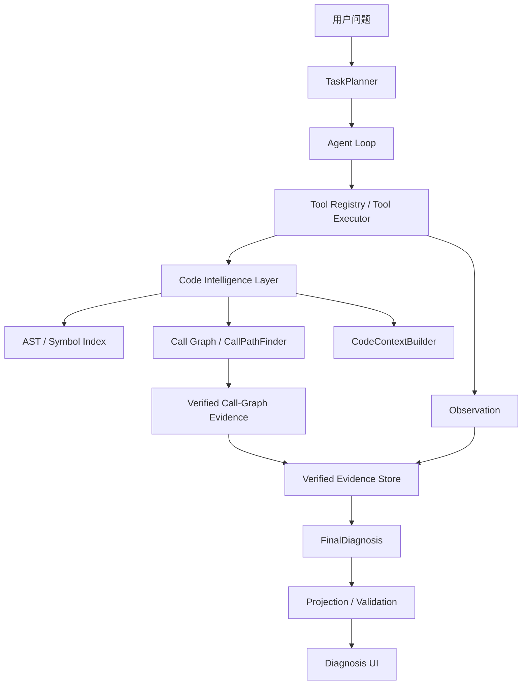
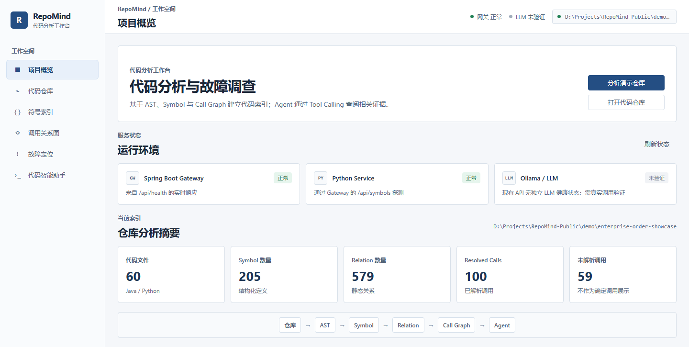
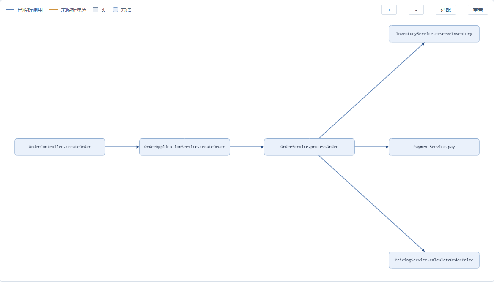
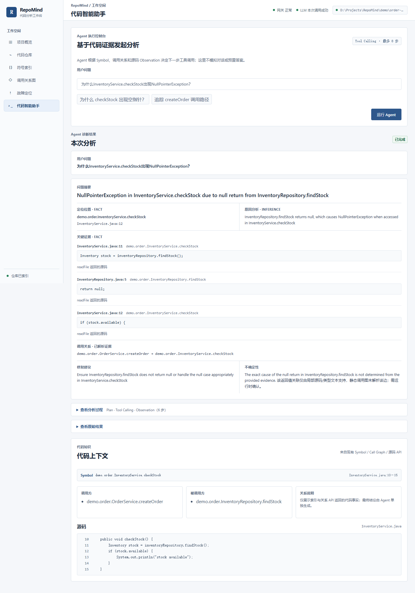
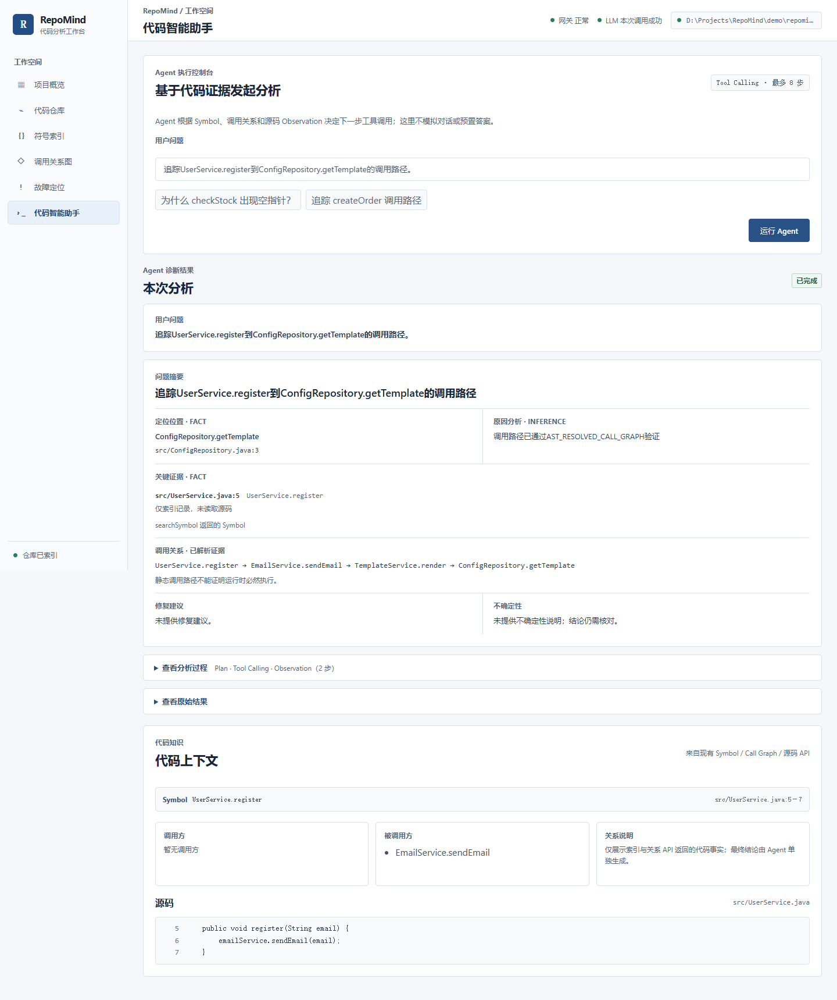
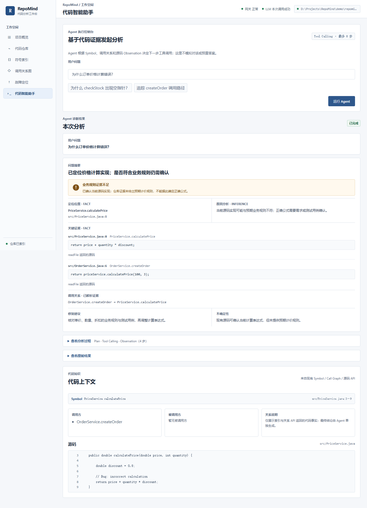
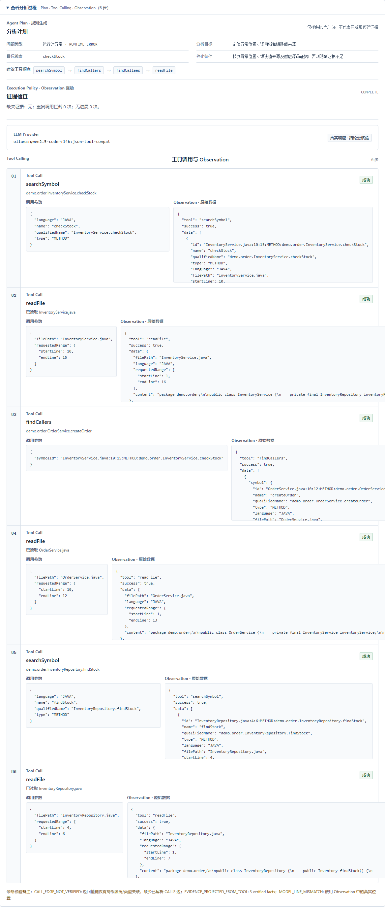

# RepoMind

RepoMind 是面向 Java 和 Python 仓库的本地 LLM 代码理解与故障诊断系统。它通过静态分析建立代码结构与调用关系，再由 Agent 按问题调用代码工具，将可核验的源码事实与模型推断分开呈现。

## 核心能力

- **代码结构解析**：基于 tree-sitter 解析 Java/Python AST，建立 Symbol Index，抽取 CALLS、IMPORTS、EXTENDS、IMPLEMENTS、REFERENCES 等关系。
- **调用关系分析**：构建 Call Graph；CallPathFinder 在已解析调用边上进行确定性路径查询，辅助追踪跨方法调用。
- **Agent 代码分析**：TaskPlanner 制定分析计划，Agent Loop 通过 Tool Calling 完成 Symbol 检索、Caller/Callee 查询和源码读取，并记录每步 Observation。
- **证据化诊断**：Verified Evidence Store 管理工具与调用图证据；FinalDiagnosis 的 Projection / Validation 将可核验事实与 LLM 推断分离。
- **可视化分析**：Vue 3 控制台展示仓库、Symbol、Call Graph、分析计划、Tool Trace、代码证据与诊断结果。

## 架构



前端经 Spring Boot 网关访问 FastAPI。Ollama 接入本地 `qwen2.5-coder:14b`，负责 Agent 的推理与工具选择；AST、Call Graph 和源码读取仍由代码分析层完成。

## 工作流程

用户问题 → TaskPlanner → Agent Loop / Tool Calling → Observation → Verified Evidence → FinalDiagnosis。Agent 可根据上一轮 Observation 继续调用工具或生成诊断；最终展示区分源码事实与模型推断。

## 功能展示

### 企业订单 Showcase

独立的 [Java 订单处理仓库](demo/enterprise-order-showcase/)串联客户、定价、库存、支付、配送、通知与审计，用于观察 RepoMind 在较大仓库中的真实表现。[演示记录与限制](docs/showcase/enterprise-order-showcase.md)列出实际分析结果。概览中的服务状态仅是拍摄时的探测结果。

<a href="docs/screenshots/showcase-overview.png"></a>

下图是订单主干与定价、库存、支付分支的**聚焦视图**：仅从真实 Call Graph API 返回值中筛选 6 个 Symbol 和 5 条已解析边，再由原有 Cytoscape 组件渲染。它不是全仓图，也不是前端现有的筛选功能。[查看完整图](docs/screenshots/showcase-call-graph-full.png)。

<a href="docs/screenshots/showcase-call-graph-focus.png"></a>

[查看 Showcase 跨文件库存诊断截图](docs/screenshots/showcase-cross-file-diagnosis.png)：FinalDiagnosis 中的赋值、空值返回和解引用分别来自两份源码的真实 `readFile` Observation；接口实现只是静态候选，不证明运行时实际分派。技术记录与边界见[演示文档](docs/showcase/enterprise-order-showcase.md)。

### 故障定位 · Inventory NPE

对 `InventoryService.checkStock` 的异常提问后，界面展示相关 Symbol、源码位置和工具执行记录；根因说明与可核验代码证据分开展示。

### 调用链分析 · 用户注册

CallPathFinder 沿已解析的静态调用边查询 `UserService.register` 到 `ConfigRepository.getTemplate` 的路径，并展示调用关系来源。

### 证据不足处理 · 订单价格

当源码中能找到计算实现、却没有预期计价规则时，诊断保留不确定性，不把猜测写成业务结论。

三种诊断结果对照（点击缩略图查看完整界面）：

| Inventory NPE | 用户注册调用链 | 订单价格 · 证据不足 |
| --- | --- | --- |
| <a href="docs/screenshots/inventory-npe-final-diagnosis.png"></a> | <a href="docs/screenshots/register-call-chain.png"></a> | <a href="docs/screenshots/price-evidence-insufficient.png"></a> |

### Agent 执行过程

下图来自 Inventory NPE 问题的一次真实本地 Ollama 执行，包含规则生成的 Plan、Provider、Tool Calling 与 Observation。当前 Provider 使用 `json-tool-compat` 兼容方式；Plan 是分析方向，最终结论仍以工具返回的证据为准。

<details>
<summary>展开 Agent Trace 截图（Plan · Tool Calling · Observation）</summary>

<a href="docs/screenshots/public-agent-trace.png"></a>

</details>

## 技术栈

| 模块 | 技术 |
| --- | --- |
| Code Intelligence | Python、tree-sitter、AST、Symbol Index、Call Graph |
| Agent / LLM | FastAPI、Ollama、`qwen2.5-coder:14b`、Tool Calling |
| Backend Gateway | Java、Spring Boot |
| Frontend | Vue 3、TypeScript、Vite、Element Plus、Cytoscape.js |
| Engineering | REST API、PowerShell 脚本、Git |

## 快速开始

以下命令适用于 Windows PowerShell。准备 Python、Java、Maven、Node.js/npm 和已启动的 Ollama；本地模型为 `qwen2.5-coder:14b`。在仓库根目录执行：

```powershell
ollama pull qwen2.5-coder:14b
python -m venv services/python-service/.venv
& .\services\python-service\.venv\Scripts\python.exe -m pip install -r services/python-service/requirements.txt
Push-Location services/frontend
npm ci
Pop-Location
.\scripts\start-demo.ps1 -Demo inventory
.\scripts\check-readiness.ps1 -Demo inventory -RequireAnalysis -Strict
```

访问 [http://127.0.0.1:5173](http://127.0.0.1:5173)。启动脚本检查 Ollama，并启动或核验 FastAPI、Spring Boot 和前端；随后分析选定的 Demo 仓库。切换演示时运行 `.\scripts\prepare-demo.ps1 -Demo register` 或 `.\scripts\prepare-demo.ps1 -Demo price`；每次切换都会替换当前内存索引。

分析独立的企业订单 Showcase 时，在仓库根目录运行 `.\scripts\prepare-showcase.ps1`；它同样会替换当前内存索引，不影响冻结的 Demo 文件。

## 项目结构

```text
services/
  python-service/   代码分析、Agent 与 FastAPI
  java-service/     Spring Boot 网关
  frontend/         Vue 3 分析控制台
scripts/            本地启动与演示准备
demo/               示例仓库
docs/               发布、评测与项目说明
```

## 当前边界

- Call Graph 来自静态分析，不证明运行时路径实际执行。
- Python 动态分派采取保守解析。
- 尚未覆盖配置文件的语义关联。

更多说明见[企业订单演示记录](docs/showcase/enterprise-order-showcase.md)、[发布文档](docs/release/)、[评测记录](docs/evaluation/)和[项目介绍](docs/interview/)。
