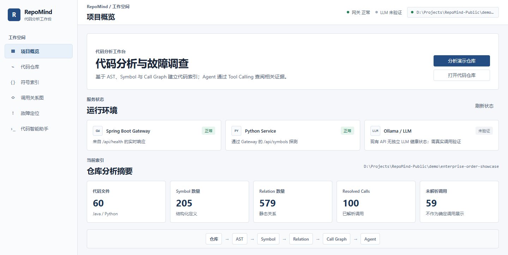
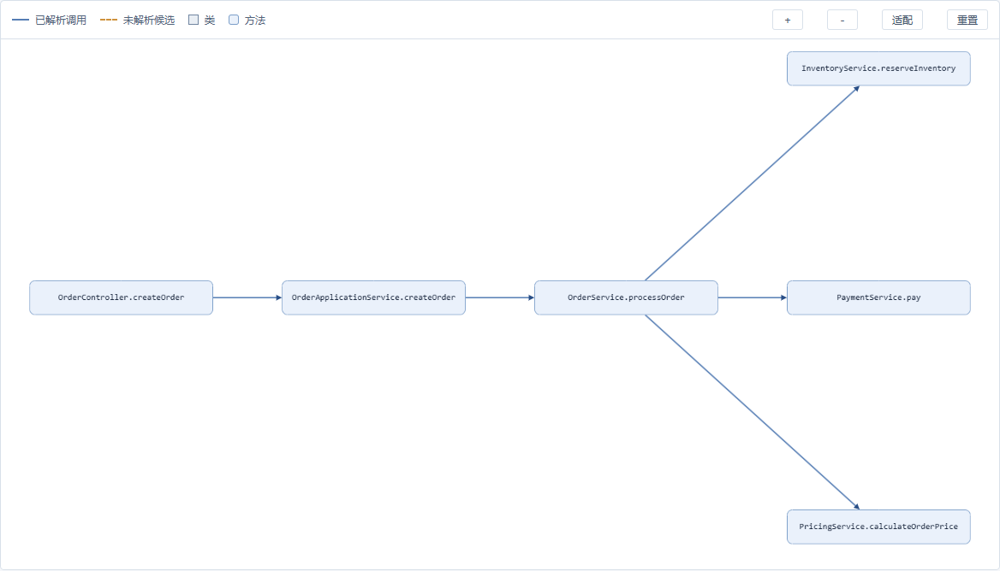
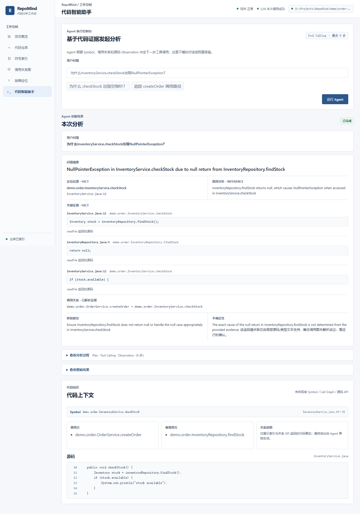
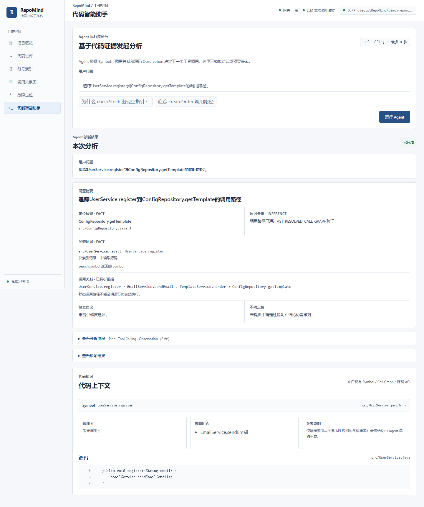
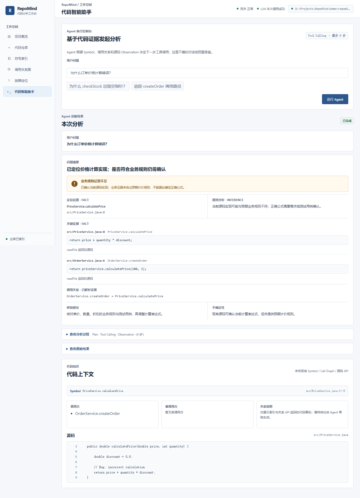
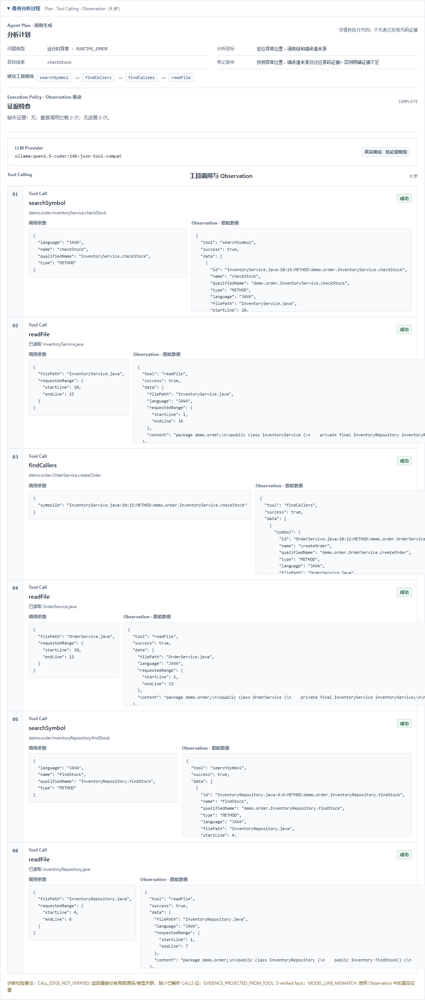

# RepoMind

**代码仓库分析与故障定位平台**

## 项目简介

RepoMind 是面向 Java/Python 代码仓库的代码分析与故障定位平台，通过 AST、Symbol、Call Graph 和源码上下文建立结构化代码索引，并结合本地 LLM 与 Tool Calling 辅助多步代码检索与问题定位。

平台以静态分析和源码证据为基础：Python/FastAPI 提供代码分析与检索服务，Java/Spring Boot 提供前端 API 网关，Vue 控制台展示代码关系与诊断过程。模型辅助选择工具和组织诊断，最终展示区分可核验的源码事实与模型推断。

## 系统架构

~~~mermaid
flowchart TD
    R["Java / Python 代码仓库"] --> A["tree-sitter AST"]
    A --> S["Symbol Index / 代码关系"]
    S --> G["Call Graph / CallPathFinder"]
    S --> C["CodeContextBuilder / 源码上下文"]
    S --> T["代码检索工具"]
    G --> T
    C --> K["结构化代码上下文"]
    U["Vue 分析控制台"] --> J["Spring Boot API 网关"]
    J --> F["FastAPI 代码分析服务"]
    F --> S
    F --> L["Agent Loop / 本地 LLM"]
    L --> T
    T --> O["Observation / Verified Evidence"]
    O --> D["FinalDiagnosis / Projection / Validation"]
    D --> U
~~~

静态分析、调用路径查询和源码读取由代码分析层完成，不依赖模型生成代码关系。Agent 在已有索引和工具之上辅助检索与诊断。

## 静态分析能力

- 使用 tree-sitter 解析 Java/Python AST，提取代码中的结构化 Symbol。
- 建立 Symbol Index，关联符号名称、类型、源码文件与行范围。
- 抽取 CALLS、IMPORTS、EXTENDS、IMPLEMENTS、REFERENCES 等关系，并保留关系来源与解析状态。

## Symbol 与 Call Graph

Symbol Index 支持定位目标类、方法或函数；Call Graph 提供 caller/callee 查询。CallPathFinder 仅沿已解析的 CALLS 边执行有界、确定性的路径查询，用于追踪静态跨方法调用关系。

调用边来自源码分析，是代码关系证据，不代表对应路径在运行时一定执行。

## 代码上下文与检索工具

CodeContextBuilder 按范围和数量限制组合目标 Symbol、源码片段、父级、imports、callers、callees 与 references，并保留源码位置及关系证据。

| 工具 | 用途 |
| --- | --- |
| searchSymbol | 按名称、限定名、类型和语言检索结构化 Symbol |
| readFile | 读取已分析仓库内指定行范围的源码 |
| findReferences | 查找指向目标 Symbol 的已解析引用 |
| findCallers | 查询目标 Symbol 的调用方 |
| findCallees | 查询目标 Symbol 调用的其他符号 |

## 故障定位流程

1. 分析仓库，建立 AST、Symbol 和代码关系索引。
2. 根据异常或业务描述检索目标 Symbol，查看源码及上下游调用关系。
3. 汇集工具 Observation 与可核验的调用图证据。
4. 生成诊断并通过 Projection / Validation 展示源码事实、模型推断和证据边界。

分析控制台可查看 Symbol、Call Graph、工具执行记录和源码位置，支持从诊断结论回到相关代码。

## Agent / Tool Calling

TaskPlanner 为问题制定分析计划，Agent Loop 通过 Tool Registry / Tool Executor 调用代码检索工具，根据上一轮 Observation 继续检索或生成诊断。Verified Evidence Store 管理工具和调用图证据，FinalDiagnosis 的 Projection / Validation 将可核验事实与 LLM 推断分开展示。

本地 LLM 通过 Ollama 接入，当前演示配置使用 qwen2.5-coder:14b。模型承担推理与工具选择，AST、Symbol 和 Call Graph 仍由静态分析层构建。

## 技术栈

| 类别 | 技术 |
| --- | --- |
| API 网关 | Java、Spring Boot |
| 代码分析服务 | Python、FastAPI、tree-sitter |
| 结构与关系 | AST、Symbol Index、Call Graph、CodeContextBuilder |
| 辅助诊断 | Tool Calling、Agent Loop、Ollama |
| 前端 | Vue 3、TypeScript、Vite、Element Plus、Cytoscape.js |
| 工程 | REST API、PowerShell、Git |

## 本地运行

以下命令适用于 Windows PowerShell。准备 Python、Java、Maven、Node.js/npm 和已启动的 Ollama；本地模型为 `qwen2.5-coder:14b`。在仓库根目录执行：

```powershell
ollama pull qwen2.5-coder:14b
python -m venv services/python-service/.venv
& .\services\python-service\.venv\Scripts\python.exe -m pip install -r services/python-service/requirements.txt
Push-Location services/frontend
npm ci
Pop-Location
.\scripts\start-demo.ps1 -Demo inventory
.\scripts\check-readiness.ps1 -Demo inventory -RequireAnalysis -Strict
```

访问 [http://127.0.0.1:5173](http://127.0.0.1:5173)。启动脚本检查 Ollama，并启动或核验 FastAPI、Spring Boot 和前端；随后分析选定的 Demo 仓库。切换演示时运行 `.\scripts\prepare-demo.ps1 -Demo register` 或 `.\scripts\prepare-demo.ps1 -Demo price`；每次切换都会替换当前内存索引。

分析独立的企业订单 Showcase 时，在仓库根目录运行 `.\scripts\prepare-showcase.ps1`；它同样会替换当前内存索引，不影响冻结的 Demo 文件。

## 项目界面

### 企业订单 Showcase

独立的 [Java 订单处理仓库](demo/enterprise-order-showcase/)串联客户、定价、库存、支付、配送、通知与审计，用于观察 RepoMind 在较大仓库中的真实表现。[演示记录与限制](docs/showcase/enterprise-order-showcase.md)列出实际分析结果。概览中的服务状态仅是拍摄时的探测结果。

<a href="docs/screenshots/showcase-overview.png"></a>

下图是订单主干与定价、库存、支付分支的**聚焦视图**：仅从真实 Call Graph API 返回值中筛选 6 个 Symbol 和 5 条已解析边，再由原有 Cytoscape 组件渲染。它不是全仓图，也不是前端现有的筛选功能。[查看完整图](docs/screenshots/showcase-call-graph-full.png)。

<a href="docs/screenshots/showcase-call-graph-focus.png"></a>

[查看 Showcase 跨文件库存诊断截图](docs/screenshots/showcase-cross-file-diagnosis.png)：FinalDiagnosis 中的赋值、空值返回和解引用分别来自两份源码的真实 `readFile` Observation；接口实现只是静态候选，不证明运行时实际分派。技术记录与边界见[演示文档](docs/showcase/enterprise-order-showcase.md)。

### 故障定位 · Inventory NPE

对 `InventoryService.checkStock` 的异常提问后，界面展示相关 Symbol、源码位置和工具执行记录；根因说明与可核验代码证据分开展示。

### 调用链分析 · 用户注册

CallPathFinder 沿已解析的静态调用边查询 `UserService.register` 到 `ConfigRepository.getTemplate` 的路径，并展示调用关系来源。

### 证据不足处理 · 订单价格

当源码中能找到计算实现、却没有预期计价规则时，诊断保留不确定性，不把猜测写成业务结论。

三种诊断结果对照（点击缩略图查看完整界面）：

| Inventory NPE | 用户注册调用链 | 订单价格 · 证据不足 |
| --- | --- | --- |
| <a href="docs/screenshots/inventory-npe-final-diagnosis.png"></a> | <a href="docs/screenshots/register-call-chain.png"></a> | <a href="docs/screenshots/price-evidence-insufficient.png"></a> |

### Agent 执行过程

下图来自 Inventory NPE 问题的一次真实本地 Ollama 执行，包含规则生成的 Plan、Provider、Tool Calling 与 Observation。当前 Provider 使用 `json-tool-compat` 兼容方式；Plan 是分析方向，最终结论仍以工具返回的证据为准。

<details>
<summary>展开 Agent Trace 截图（Plan · Tool Calling · Observation）</summary>

<a href="docs/screenshots/public-agent-trace.png"></a>

</details>

## 项目结构

```text
services/
  python-service/   代码分析、Agent 与 FastAPI
  java-service/     Spring Boot 网关
  frontend/         Vue 3 分析控制台
scripts/            本地启动与演示准备
demo/               示例仓库
docs/               发布、评测与项目说明
```

## 已知边界

- Call Graph 基于静态分析，不代表实际运行时调用路径。
- 对动态分派与多实现调用采用保守解析，存在歧义时保持 unresolved。
- 暂未覆盖配置文件的语义关联。

更多说明见[企业订单演示记录](docs/showcase/enterprise-order-showcase.md)、[运行与演示文档](docs/release/)、[评测记录](docs/evaluation/)和[项目说明](docs/interview/)。
